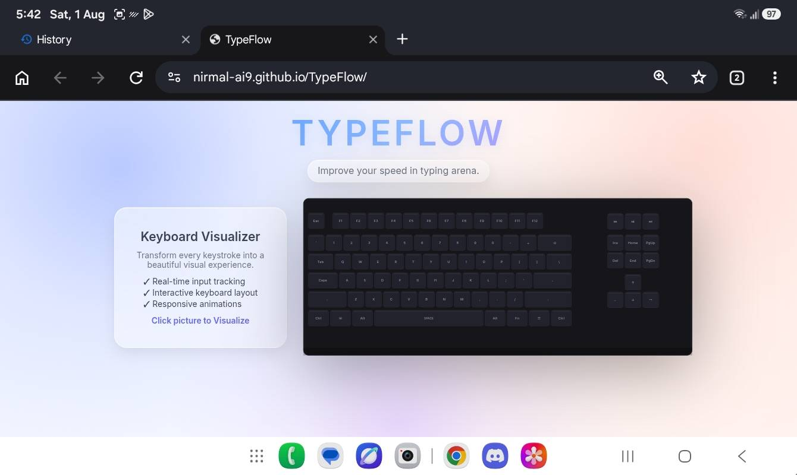
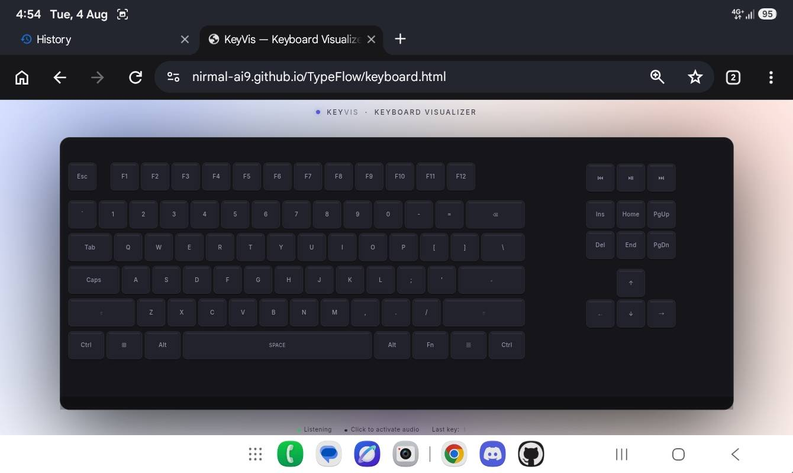
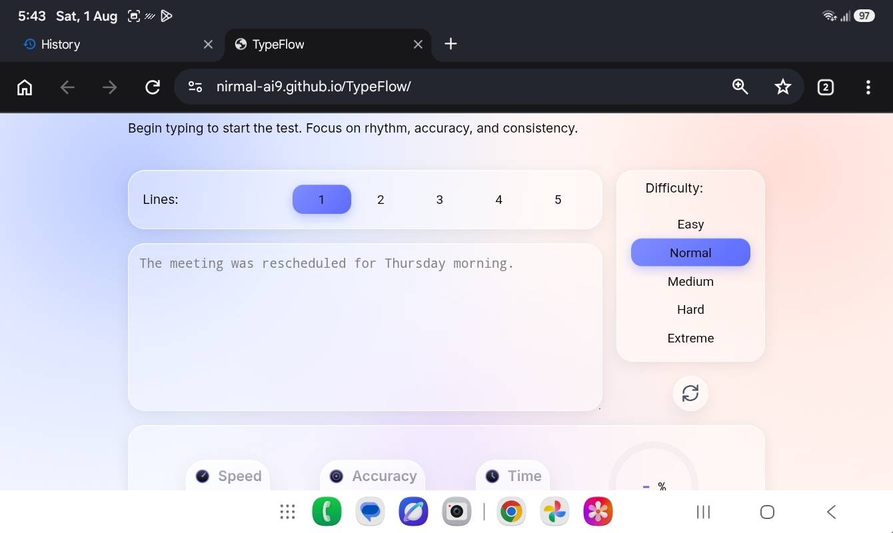

# TypeFlow

TypeFlow is a typing practice application designed to keep the experience simple, fast, and distraction-free. It measures your typing speed and accuracy in real time, allowing you to focus on improving rather than navigating a complicated interface.

This project started as a way to learn frontend development, but gradually evolved into a complete application with multiple iterations, UI improvements, and performance optimizations. Every version has been an opportunity to experiment with new ideas while keeping the experience lightweight and enjoyable.

# Screenshot 

## Landing page :


## KEYVIS (A keyboard visualizer) : 


## Typing area :


### Join Our Discord Community

Have questions, ideas, or feedback? Join the Discord server to discuss projects, suggest features, report bugs, and connect with other developers.

🔗 Discord: https://discord.gg/dKa2wEJGF9

Everyone is welcome. See you there!

## Running the Project

Clone the repository and open `index.html` in your browser.

```bash
git clone https://github.com/your-username/TypeFlow.git
cd TypeFlow
```

No installation or build tools are required.

## Project Goals

- Make typing practice simple and accessible.
- Provide real-time feedback without distractions.
- Keep the project lightweight and easy to understand.
- Continuously improve the interface and user experience.

## Contributing

Contributions, suggestions, and bug reports are always welcome. Feel free to open an issue or submit a pull request.

## License

This project is licensed under the GNU General Public License v3.0 (GPL-3.0). See the `LICENSE` file for more information.

## Author : Nirmal
